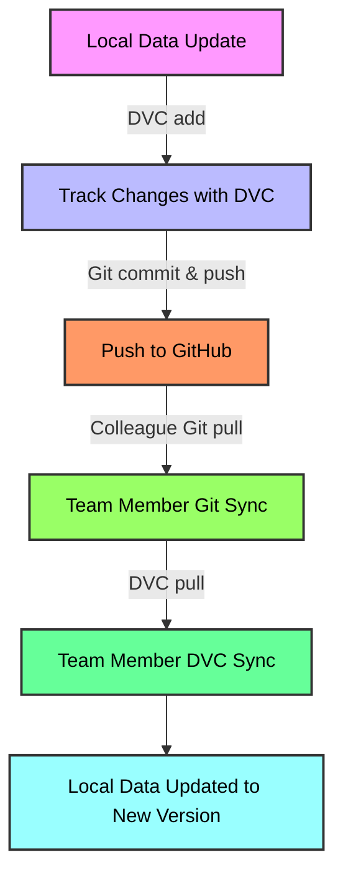

# Data Version control

## Using DVC for Data Version Control

### Overview

In the realm of data science and machine learning, managing and
versioning large datasets effectively is crucial for maintaining the
integrity and reproducibility of projects. Data Version Control (DVC) is
an essential tool that provides robust mechanisms for data versioning.
By integrating DVC into our workflow, we gain a high level of control
over our data assets, ensuring that our datasets are managed in a
consistent, traceable, and efficient manner.

DVC is designed to complement the traditional code version control
systems, allowing us to handle large data files and datasets with ease.
It enables our team to track changes in data, manage different versions
of datasets, and link specific data versions to our experiments and
model versions. This capability is vital for ensuring that our projects
are reproducible and that we can easily revert or branch data as needed,
just like we do with our code.

### Why DVC?

DVC stands out as a tool specifically tailored for data management in
several key ways:

- **Versioning Large Datasets**: It provides a Git-like interface for
  data files, enabling us to track changes and maintain a history of
  modifications.
- **Reproducibility**: By binding specific versions of data to our
  project stages, DVC ensures that we can always replicate our results
  with the exact data used in any given experiment.
- **Collaboration**: With DVC, sharing data changes becomes more
  manageable, allowing for synchronized and consistent data usage across
  the team.

Integrating DVC into our data management strategy solidifies our
commitment to maintaining best practices in data handling, ensuring that
our projects are not only innovative but also methodically sound and
reproducible.

## Setting Up DVC for Data Version Control

Integrating Data Version Control (DVC) into our workflow is a
straightforward process. DVC is versatile and supports various storage
options including cloud services like Azure and AWS, as well as local
storage. Here’s how you can set it up:

### Step 1: Initialize DVC in Your Project

Navigate to your project repository and initialize DVC:

```bash
dvc init
```

This command creates a `.dvc` directory, signifying that DVC is now
tracking the data in this repository.

### Step 2: Set Up Remote Storage

DVC supports various storage backends. Depending on where you want to
host your data (Azure, AWS, or locally), the setup will differ slightly.

- **For Azure Blob Storage**:
  ```bash
  dvc remote add -d myremote azure://mycontainer/path
  dvc remote modify myremote connection_string 'myconnectionstring'
  ```

- **For AWS S3**:
  ```bash
  dvc remote add -d myremote s3://mybucket/path
  # Configure AWS credentials via environment variables, AWS credentials file, or IAM roles.
  ```

- **For Local Storage**:
  ```bash
  dvc remote add -d myremote /path/to/local/storage
  ```

In these commands, `myremote` is the name of the remote storage, which
you can change to something more descriptive of your specific setup.

### Step 3: Add Data to DVC

Add your data files or directories to DVC. This tells DVC to track the
specified files or directories:

```bash
dvc add data/dataset.csv
```

### Step 4: Commit Changes to Version Control

After adding files or directories to DVC, commit the changes to both DVC
and Git. This synchronizes the data tracking with your version control
system:

```bash
git add data/dataset.csv.dvc data/.gitignore
git commit -m "Add dataset with DVC"
```

### Step 5: Push Data to Remote Storage

Finally, push your data to the configured remote storage. This ensures
that your data is backed up and can be shared with others:

```bash
dvc push
```

## Local Data Updates with DVC: An Example

### Scenario

Imagine you have a dataset file named `dataset.csv` that you're already
tracking with DVC. You've made some updates to this file - perhaps
you've added more data, removed some entries, or modified existing data.

### How DVC Detects Changes

1. **DVC's Checksum Mechanism**:
   - DVC uses a checksum (a type of hash value) to track the version of
     each file. When you first run `dvc add dataset.csv`, DVC calculates
     and stores this file's checksum in the corresponding `.dvc` file.
   - When you modify `dataset.csv`, its checksum changes. DVC detects
     that the current checksum of the file doesn't match the one stored
     in the `.dvc` file, indicating that the file has been altered.

2. **Communicating Changes to the User**:
   - To see which files have changed, you can use the command `dvc
     status`. This command compares the current checksums of files with
     those stored in `.dvc` files.
   - If there are changes, DVC will list the files that have been
     modified. For example, it might show `dataset.csv` as 'modified.'

### Example Commands to Track New Data Version

1. **Add the Updated File to DVC**:
   - Run `dvc add dataset.csv` again. This updates the `.dvc` file with
     the new checksum for the modified `dataset.csv`.
   - This command is crucial as it tells DVC to track this new version
     of the file.

2. **Commit the Changes to Version Control**:
   - After updating the `.dvc` file, commit these changes to your Git
     repository:
     ```bash
     git add dataset.csv.dvc
     git commit -m "Update dataset.csv with new data"
     ```

3. **Push the Changes**:
   - Use `dvc push` to upload the new version of `dataset.csv` to your
     remote DVC storage. This ensures that the updated data is backed up
     and available for others.

### The Purpose of This Process

- **Reproducibility**: By tracking every change to your data, you ensure
  that every stage of your project can be reproduced, using the exact
  version of the data that was used originally.
- **Collaboration**: This process makes sure that all team members are
  aware of the data changes and can access the exact same data versions,
  leading to consistent results across different environments.
- **Traceability**: Keeping track of data changes allows you to trace
  back to any point in the project’s history, understand what data was
  used, and why certain decisions were made.

### Conclusion

In summary, DVC’s mechanism of detecting changes through checksums,
combined with its integration with Git, allows you to effectively
version your data. This ensures that your datasets are consistently
managed and that changes are transparent and traceable across your team.
The process of updating data, running `dvc add`, committing changes, and
pushing to remote storage is essential for maintaining the integrity and
reproducibility of your data science projects.

The process for handling data updates with DVC is similar for both local
and cloud-based data, but there are some key differences to consider,
particularly in how changes are detected and synchronized.

## Cloud Data Updates with DVC: The Process

### Scenario

Suppose your data is hosted on a cloud storage service (like AWS S3,
Azure Blob Storage, etc.), and you've updated the dataset directly in
the cloud, bypassing your local machine.

### Detecting Changes in Cloud Data

1. **Local vs. Cloud State**:
   - DVC does not automatically detect changes made directly in the
     cloud storage. Instead, it relies on the local `.dvc` files to
     track the data state.
   - To understand what's changed in the cloud, you need to manually
     synchronize your local DVC environment with the cloud.

2. **Synchronizing Local and Cloud**:
   - Run `dvc pull`. This command checks the remote storage for any
     changes or new versions of the files and downloads them to your
     local machine.
   - When you execute `dvc pull`, DVC compares the checksums from the
     cloud with those stored locally in your `.dvc` files. If there are
     differences, DVC retrieves the updated files.

### Updating Cloud Data in DVC

1. **Pull the Updated Data**:
   - After detecting changes in the cloud, use `dvc pull` to update your
     local copy with the latest version from the cloud.

2. **Track and Commit the Changes Locally**:
   - If you want to version these updates (which is a best practice),
     you should `dvc add` the updated files and commit the changes to
     your Git repository, just like with local updates:
     ```bash
     dvc add dataset.csv
     git add dataset.csv.dvc
     git commit -m "Update dataset.csv with cloud changes"
     ```

3. **Push the Changes to Remote Storage**:
   - In case there are any further local changes or if you need to
     synchronize the `.dvc` files, use `dvc push`.

### The Purpose of This Process for Cloud Data

- **Consistency and Reproducibility**: Even when data is stored and
  updated in the cloud, it’s crucial to maintain consistency and
  reproducibility by tracking these changes through DVC.
- **Collaborative Work**: This process ensures that all team members are
  working with the latest version of the data, regardless of where it is
  stored or updated.
- **Version Control Integration**: By integrating DVC with cloud storage
  and your local Git repository, you maintain a robust version control
  system for your data.

### Key Differences from Local Data

- **Manual Synchronization Required**: Unlike local data changes, which
  you can detect by running `dvc status`, changes in the cloud require a
  manual `dvc pull` to synchronize.
- **Local Tracking of Cloud Changes**: It's important to track cloud
  changes locally using DVC and Git to maintain version control and
  project history.

### Conclusion

While the core principles of data versioning with DVC remain the same,
cloud data updates involve an additional step of manually synchronizing
your local environment with the cloud. This ensures that your data
management practices are consistent, transparent, and aligned with the
collaborative needs of your project.

## Communication of Data Version in a Collaborative Setting

When working collaboratively on a project using DVC and GitHub,
communication and transparency about data and model versions are key.
Here's how your colleagues can be made aware of the specific data
version used in a particular branch of the project for training a
machine learning model:

1. **Commit Messages and Pull Requests**:
   - When you commit changes (including DVC-tracked files) to a branch
     and push to GitHub, write clear and descriptive commit messages.
     For example: "Update dataset.csv to version 2.1 for model
     training".
   - If you're using Pull Requests (PRs), ensure the description clearly
     states the changes in the data and the rationale behind these
     changes. This helps team members understand the context of the
     update.

2. **DVC Files in Git**:
   - DVC tracks data changes using `.dvc` files which are committed to
     Git. These files contain metadata about the data file versions.
   - When you push these changes to GitHub, your colleagues can see the
     updated `.dvc` files in the commits or PRs. By examining these
     files, they can identify which version of the data you used.

3. **DVC Pull to Sync Data**:
   - After pulling the latest changes from GitHub, your colleagues
     should run `dvc pull` to synchronize their local data with the
     version tracked in the branch.
   - This ensures that they are working with the exact same data version
     that you used for training your model.

4. **Automated Notifications**:
   - Utilize features in GitHub like notifications, watching a
     repository, or setting up automated alerts to inform team members
     of new commits or PRs.
   - Team members who are closely following the project can stay updated
     about changes in real-time.

5. **Project Documentation**:
   - Maintain a section in your project's documentation or README file
     about the data versions being used. Update this section whenever a
     significant change is made to the dataset.

6. **Regular Team Meetings or Updates**:
   - In regular team meetings or through periodic updates (like emails
     or team chat channels), summarize key changes in the project,
     including updates to data and models.

### Using Branches to Manage Data Versions

- **Branch-Specific Data Versions**: In Git, different branches can be
  used to experiment with different data versions or model
  configurations. This allows you to isolate changes in a controlled
  environment.
- **Communicate Branch Purpose**: Clearly communicate the purpose of
  each branch in your project documentation or in the branch name
  itself, e.g., `feature/new-data-set-2.1`.

### Collaborative Tools and Integrations

- **Integration with Slack or Other Communication Tools**: Consider
  integrating GitHub with tools like Slack to automatically post updates
  about commits, PRs, and branch changes.
- **Code Review Practices**: Encourage thorough code reviews, where
  reviewers not only look at code changes but also at updates in data
  (as indicated by changes in `.dvc` files).


### Workflow for Collaborative Data Updates Using DVC and GitHub

1. **Local Data Update**:
   - You update your dataset locally. This could be any modification
     like adding new data, editing existing data, etc.

2. **Tracking Changes with DVC**:
   - Use DVC to track these changes. Run `dvc add <file_or_directory>`
     to update the DVC tracking for the changed data. This updates the
     `.dvc` file corresponding to the data, which now reflects the new
     state of your dataset.

3. **Committing and Pushing to GitHub**:
   - Commit the changes to your Git repository, including the updated
     `.dvc` file and any other modified files. Your commit message
     should clearly describe the changes made.
   - Push these commits to a branch in your GitHub repository.

4. **Team Member's Syncing Process**:
   - Your colleagues, upon learning about the update (via pull request,
     notification, or any other communication channel), will first pull
     the latest changes from the GitHub repository. This includes the
     updated `.dvc` files but not the actual data.
   - They then run `dvc pull` in their local environment. This command
     fetches the updated data files from the DVC remote storage and
     replaces the older version of the data in their local workspace
     with the version you just pushed.

### What Happens During the Sync?

- **DVC Remote Storage**: The updated data resides in the DVC remote
  storage (which could be on cloud services like AWS S3, Azure Blob
  Storage, or a local server). When you push changes with DVC, the
  updated data is transferred to this remote storage.
- **Rewriting Local Data**: When your colleagues run `dvc pull`, DVC
  fetches the specific version of the data associated with the latest
  commit from the remote storage. Their local data files are then
  updated (rewritten) to match this version.

### Ensuring Consistency

- **Version Control of Data**: The `.dvc` files in your Git repository
  ensure that everyone is aware of which version of the data should be
  used with the current codebase.
- **No Direct Data Overwrite in Git**: It's important to note that the
  data files themselves are not stored or directly overwritten in the
  Git repository. The synchronization of the actual data files happens
  through DVC commands (`dvc push` and `dvc pull`), while Git handles
  the version control through `.dvc` files.

### Conclusion

In summary, by using DVC in conjunction with Git, you can update
datasets on your local machine and track these changes. When you push
these changes to GitHub, your colleagues can then update their local
copies to match your data version, ensuring everyone in the team is
working with the same dataset. This process is crucial for maintaining
consistency, reproducibility, and effective collaboration in data-driven
projects.



### How to Read the Diagram

- **Local Data Update**: This is where you make changes to your dataset
  locally.
- **Track Changes with DVC**: After updating the data, you use `dvc add`
  to track these changes.
- **Push to GitHub**: Commit the updated `.dvc` file and push these
  changes to GitHub.
- **Team Member Git Sync**: Your colleagues pull the latest changes from
  the GitHub repository.
- **Team Member DVC Sync**: They run `dvc pull` to synchronize their
  local data with the updated version stored in DVC remote storage.
- **Local Data Updated to New Version**: At this point, your colleagues
  have the same data version as you do.

## Utilizing the DVC Extension in VS Code for Data Management

Once the DVC extension is installed in VS Code, managing your data
becomes more streamlined and integrated within your development
environment. Here’s how you can effectively use the extension for data
management:

1. **View DVC Tracked Files**: Access the DVC extension's sidebar in VS
   Code to see a list of all DVC-tracked files and stages in your
   project. This offers a clear overview of your data files and their
   status.

2. **Execute DVC Commands**: Directly interact with your data through
   the VS Code interface. Right-click on the DVC-tracked files or stages
   to run common DVC commands such as `dvc pull`, `dvc push`, or `dvc
   repro`. This feature simplifies executing DVC commands and reduces
   the need to switch between the terminal and the code editor.

3. **Monitor Pipeline Status**: The extension provides a visualization
   of your DVC pipelines. You can track the progress and status of
   different stages in your data pipelines, making it easier to identify
   and resolve issues.

4. **Manage Experiments**: If you are using DVC for machine learning
   experiments, the extension allows you to browse, compare, and manage
   these experiments directly within VS Code.

By incorporating these features into your workflow, the DVC extension
for VS Code enhances your efficiency in managing data versions and
pipelines, contributing to a more productive and organized project
environment.